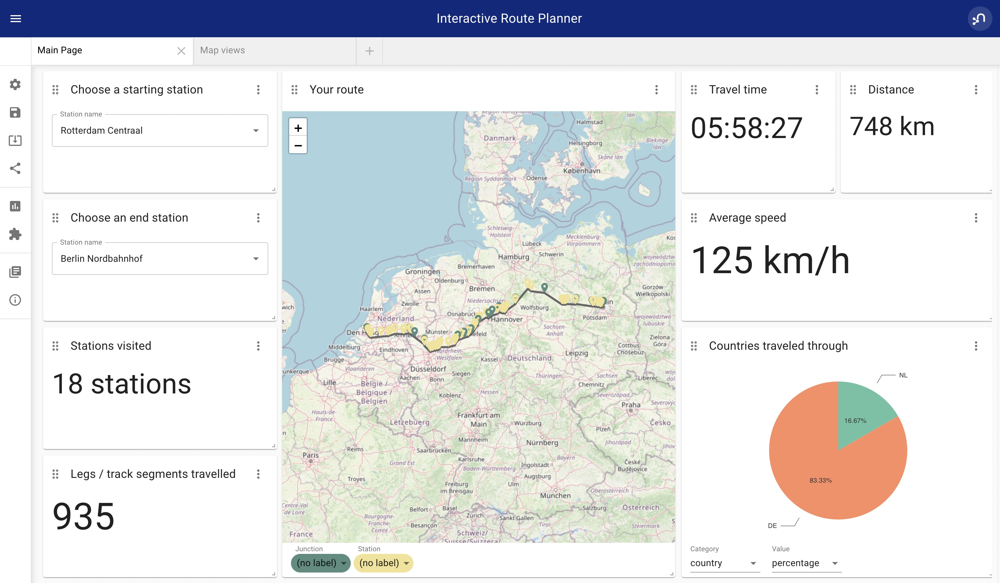

#  European Rail Network Graph
This repository contains data, queries and visualizations for visualizing the European Rail Network inside Neo4j.

This demo was prepared for NODES 2022 - slides are available here: https://docs.google.com/presentation/d/17Dp64vB-FIGzHt3IWnge4eMRi2CtloNVS5dT7S4DUJQ/edit?usp=sharing.



## Contents
This repository consists of:

| Item               | Description                                                                                 |
|-----------------------|-------------------------------------------------------------------------------------|
| A Data Model Sketch (`model/model.json`)   | This can be loaded into arrows.app. |
| Load Queries (`cypher/load-queries.cypher`) | These can be copy pasted into Neo4j Browser. Make sure multi-statement Cypher is enabled in the editor so you can copy-paste the entire file.  |
| Analytical Queries (`cypher/analytical-queries.cypher`)| Queries for doing pathfinding between stations in the graph.  |
| NeoDash Dashboard (`dashboard/dashboard.json`)  (`cypher/analytical-queries.cypher`)| A dashboard file you can load into [NeoDash](https://neodash.graphapp.io).  |


> The queries here have been built for and tested with Neo4j 5.1. A no-installation-required demo of the dashboard is also available at https://neodash-gallery.graphapp.io.


## Source Data
As source data, this graph uses two public datasets provided by opendatasoft.com.

| Dataset               | URL                                                                                 |
|-----------------------|-------------------------------------------------------------------------------------|
| EU Railway Stations   | https://public.opendatasoft.com/explore/dataset/europe-railway-station/information/ |
| EU Rail Road Segments | https://public.opendatasoft.com/explore/dataset/europe-rail-road/information/       |

To load all data, create a Neo4j database, install `apoc`, and move the contents of the `data` directory in this repository into your `import` folder in Neo4j.
Then, copy paste the contents of (`cypher/load-queries.cypher`) into your Neo4j browser. This should take a couple of minutes.


### EU Rail Road Segments
A track is a (curved) part of train track that consists of multiple (smaller, straight) track segments. 
Keep in mind, track are not the same as routes between stations, we establish these later.

Our base infrastructure graph will have the following shape:

```
(p1:Point)-[:TRACK]->(p2:Point)
(p1:Point)-[:TRACK_SEGMENT]->(:Point)-[:TRACK_SEGMENT]->(p2:Point)
```

> As a cool routing option, we create an extra track (missing in the source data) to represent the eurotunnel between Dover and Calais.

Meanings of properties in the source data are documented here:
https://eurogeographics.org/wp-content/uploads/2018/04/EGM_Specification_v10.pdf


### EU Railway Stations
Load the stations dataset, and overlay it onto the junctions.

> Note - we are matching on 8127 out of 8128 stations here, with the exception of Nagyatad station in Hungary. For now, we can ignore this one.

### Junctions
Junctions are an artificial construct that are needed for efficient pathfinding and routing. We define junctions as:
- Points where more than two tracks meet.
- Points where only one track is present (e.g. the end of the track).
- A point where a station is located.


Junctions are created as part of (`cypher/load-queries.cypher`).

### Routes
Routes are established between Junction points as part part of (`cypher/load-queries.cypher`).
A `ROUTE` relationship represents the shortest paths between two adjacent junctions. A real route (between stations) might cross several `ROUTE` relationships.

```
(j1:Junction)-[:ROUTE]->(j2:Junction)**
(s1:Station)-[:ROUTE]->(j1:Junction)-[:ROUTE]->(j2:Junction)-[:ROUTE]->(s2:Station)
```

Routes are created 
## Questions
For questions, comments, feedback, reach out to me or create an issue on GitHub. 